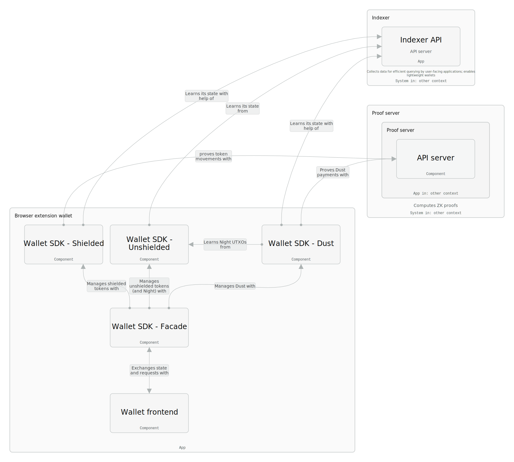
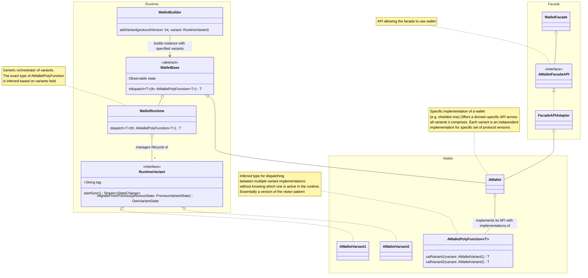
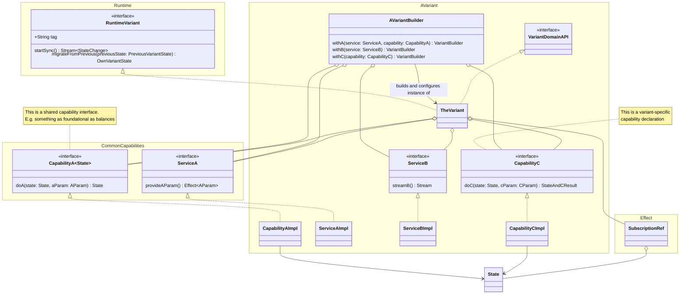

# Wallet SDK Design

This document is compilation of the design of the Wallet SDK. Some parts of it are captured (through
[ADRs](./decisions/)), some (high-level) are captured in this
[IcePanel diagram](https://app.icepanel.io/landscapes/yERCUolKk91aYF1pzsql/versions/latest/diagrams/editor?diagram=JwWBu6RYGg&model=onccvco5c4p&overlay_tab=tags&x1=-1463.3&y1=-830.7&x2=2295.3&y2=1129.3),
and some are more ephemeral.

## High-level structure

Midnight implements 3 kinds of tokens/resources, which wallet needs to be aware of:

- Night and other unshielded tokens
- Dust for paying fees
- Custom shielded tokens

Each of them uses a different address and way of proving credentials to use the tokens/resources, as well as each of
them needs a completely different state to operate on. For that reason, Midnight Wallet SDK is conceptually split into 4
components:

- Unshielded wallet
- Dust wallet
- Shielded wallet
- Wallet Facade

The diagram belows shows their relationships and, when selecting a component, provides more context to it. Its original
is created in IcePanel and can be found at https://s.icepanel.io/qSrUvJk8tEUSRP/iPN0



## Single wallet structure

Each of the wallets follows the same structure - front facing adapter providing API compatible with the Wallet Facade,
variant-based specific implementation(s) of the wallet, Runtime orchestrating the variants and Wallet Builder allowing
to register all the variants.



Structure like this has many benefits:

- it enables seamless wallet state migration in case of hard-forks using a uniform framework
- each variant can be very independent implementation (even coming from a separate package), with a completely different
  API (which is important for WASM-based libraries produced by wasm-bindgen)
- unnecessary code can be decomissioned
- code for upcoming hard-forks can be implemented and tested in isolation, before integrating with the facades
- users of the SDK can replace some variants with their own implementation if really needed

## Single Variant structure

Even though the framework established around Runtime does not enforce much of a structure, to bring consistency,
predictability and robustness to a variant implementation, structure as presented below is desired, it is fully
implemented with the shielded wallet default variant:



This structure emerged from a couple of decisions taken together:

1. To follow a Bloc-like API. That is one, where the state is a stream that can be subscribed to, and can only be
   modified in a controlled and encapsulated way - through dedicated methods in our case (originally BLoC pattern
   accepts events as the only input, but in JS world it would make it look like Redux, which is not necessarily a
   feature).
2. To separate state operations from synchronization and atomicity concerns
3. To leverage `Effect` library and immutability to the extent possible

### State type

This is the core domain datatype of wallet variant and the state type that the Runtime attaches with a variant. It needs
to maintain its invariants at all times, even in the presence of multiple concurrent writers (like sync mechanism and
user requests related to transactions). It also should enable testing most of the wallet behavior on a unit level to
provide a quick feedback loop to the developer. It also has a special meaning in the context of the Runtime. This state
needs to be always complete and enable restoring wallet variant from it. So it either needs to contain all data needed
for operation or it needs to contain proper links to resolve all the data. Alternatively, a variant may use a different
type internally. In such case a bi-directional mapping is needed between the state type present in variant's declaration
(and used by Runtime) and the one used internally.

### Services and capabilities

Many aspects of wallet software functionality can be compartmentalized into feature-specific interfaces. Also, depending
on context, some of them might or might not be needed in certain situation at all. For that reason all wallet variant
functionality is meant to be separated into _Services_ and _Capabilities_.

A _Service_ is a possibly asynchronous or side-effecting object, giving access to some data or performing some
additional processing steps.

A _Capability_ is a purely functional extension to _State_ interface, which focuses on specific functionality.

For example:

- for synchronization there is both service and a capability - service receives some initial state to know how to start
  and returns a stream of updates, while capability has function, which takes current state, an update and returns new
  state with the update applied
- for transacting there is a capability, which receives current state, details of a request regarding transaction to be
  created, and returns ready-to-finalize transaction recipe together with new state (with, e.g. coins/UTxOs booked for
  the transaction)
- for finalization/proving, there is a service only, which takes a transaction recipe and turns that into a ready
  transaction
- for coins, there is a capability only, which lists available coins, as well as computes different kinds of balances
  (available, total, pending)

### Summary and code example

Immutability, combined with allowing only pure functional, synchronous operations on the state, covers a lot of what is
required to implement a wallet robustly. It is the same foundation that enables e.g. Redux or the Elm architecture. But
there needs to be a way to hold the state itself and to update it in relation to side-effecting operations. This is
achieved by leveraging Effect's `SubscriptionRef` and implementing a Bloc-like API. Below is a simplified code sample,
though this exact structure is implemented fully for the initial shielded wallet variant.

```ts
// Foo.ts - some foo functionality, which comprises both a service and a capability
class AFoo {}
class FooId {}
class SomeFooData {}

// By default the state type is abstracted over in the interface, so that same API can apply to different kinds of wallets/variants
interface FooService<TState> {
    produceFooData(state: TState): Effect<SomeFooData>;
}

interface FooCapability<TState> {
    addFoo(state: TState, foo: AFoo, data: SomeFooData): TState;
    // This operation can fail, thus it returns either to communicate
    // that together with exact type of possible error
    somePossiblyFailing(state: TState, id: FooId): Either<TState, FooError>;
}

// For services and capabilities it does not make much of a difference whether they are implemented as classes or not
class DefaultFooService implements FooService<VariantState> {
    produceFooData(state: VariantState): Effect<SomeFooData> {
        /* ... */
    }
}

class DefaultFooCapability implements FooCapability<VariantState> {
    addFoo(state: VariantState, foo: AFoo, data: SomeFooData): VariantState {
        /* ... */
    }
}

// VariantState.ts - the variant state, usually implemented using following pattern
// It can leverage e.g. branded types for better encapsulation
// An alternative in form of a class is fine, but implementing immutability with
// classes is cumbersome in TS, using Effect's Data can help here a bit
type VariantState = Readonly<{
    foos: Foo[];
}>;
// Preferably it implements the basic operations, so that capabilities have something to build on top of
const VariantState = {
    addFoo: (state: VariantState, newFoo: Foo): VariantState => { /* ... */};
    maybeRemove(state: VariantState, id: FooId): Either<VariantState, VariantError> => { /* ... */ };
};

// Variant.ts - the variant, gathering everything together
class Variant {
  readonly state: Stream.Stream<VariantState>;
  readonly #ref: SubscriptionRef<VariantState>;
  readonly foo: {service: FooService<VariantState>, capability: FooCapability<VariantState>};

  constructor(ref: SubscriptionRef<VariantState>, foo: {service: FooService<VariantState>, capability: FooCapability<VariantState>}) {
    this.#ref = ref;
    this.state = SubscriptionRef.changes(ref);
    this.foo = foo;
  }

  addFoo(foo: Foo): Effect<void> {
    return SubscriptionRef.updateEffect(this.#ref, (state) => {
        return pipe(
            this.foo.service.produceFooData(state),
            Effect.map(fooData => this.foo.capability.addFoo(state, foo, fooData)),
        );
    });
  }

  somePossiblyFailing(fooId: FooId): Effect<void, VariantError> {
    return SubscriptionRef.updateEffect(this.#ref, (state) => {
        return this.foo.capability.somePossiblyFailing(state, fooId).pipe(
            Effect.fromEither
        )
    })
  }
}

// VariantBuilder.ts - builder of the variant; it can be very simplified, just to meet the requirements of the Runtime, as well as a fully-fledged, with high degree of a customization available
class VariantBuilder {
    #foo: {service: FooService<VariantState>, capability: FooCapability<VariantState>};

    withFoo(service: FooService<VariantState>, capability: FooCapability<VariantState>) {
        this.#foo = {service, capability};
    }

    build() {
        const ref = makeRef();
        return new Variant(ref, this.#foo);
    }
}
```

## Links and references

- [Impureim sandwich](https://blog.ploeh.dk/2020/03/02/impureim-sandwich/) - on a functional design
- [BLoC Architecture](https://dev.to/wednesdaysol/guide-to-implementing-bloc-architecture-in-flutter-3j79) - on BLoC
  architecture.
- [What is the BLoc pattern?](https://www.flutterclutter.dev/flutter/basics/what-is-the-bloc-pattern/2021/2084/) - one
  of the original documents on BLoC
- The approach for state management does remind an actor model to some extent (state is managed through a dedicated
  component, all updates are serialized into a single sequence), this series of posts seems to lay out well the 'whys'
  and 'hows': [Thinking in Actors - Part 1](https://jeremycarterau.substack.com/p/thinking-in-actors-part-1),
  [Thinking in Actors - Part 2](https://jeremycarterau.substack.com/p/thinking-in-actors-part-2),
  [Thinking in Actors - Part 3](https://jeremycarterau.substack.com/p/thinking-in-actors-part-3)
